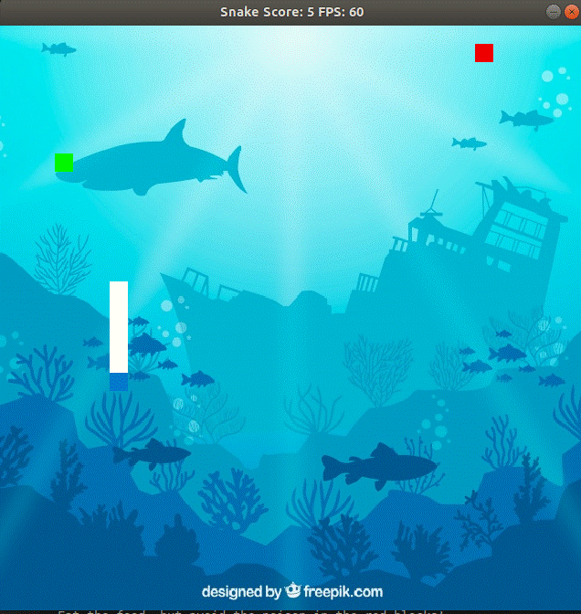

# CPPND: Capstone Snake Game, with great new features

This is an enhanced version of the starter repo provided for the capstone project of the [Udacity C++ Nanodegree Program](https://www.udacity.com/course/c-plus-plus-nanodegree--nd213). The code for this repo was inspired by [this](https://codereview.stackexchange.com/questions/212296/snake-game-in-c-with-sdl) excellent StackOverflow post and set of responses.

## File and Class Structure
This game is based on the project starter.  An additional player class has been added to hold player information, and is referenced via a unique pointer in the game class.  The game and snake classes have been modified to include multithreading, additional object oriented programming features, and smart pointers.  Updates to these classes provide a user startup menu, in-game terminal dialog, game end on snake death, and multiple levels of game play.  The Renderer class and render function are updated to add poison and to add an image background.  The main function is updated to support a startup menu and provide feedback after the game ends.

## Expected Behavior
After launching SnakeGame, a menu will prompt the user for their name, ask which level the user would like to play, and provide brief instructions for each level.  The snake is controlled using the arrow keys.

The game includes three levels.  The first level just places food on the board, and the snake will grow and get faster, and the score will increase, as it eats more food.  One addition, in all levels, the food will randomly move every 10 seconds or so if not eaten.  The second and third levels include poison blocks, marked in red.  In the second level, eating poison will decrease your length and your score.  Once your snake reaches a length of zero, it will die and the game will end.  In the third level, eating poison will immediately kill the snake, ending the game.

The game ends when the snake dies or when the user exits the game window.

Future features include saving user's names and high scores between games, offering multiple backgrounds, and adding graphics for food, poison, and the snake body.

## Rubric Items
### Loops Functions and IO
|Criteria| How is it satisfied | Where |
| --- | --- | ---|
|The project demonstrates an understanding of C++ functions and control structures.| The game additions use functions and various control flow structures.| ex: game.cpp #15-55|
|The project reads data from a file and process the data, or the program writes data to a file.| The updated game reads in a background image using the SDL image library and applies it to the background of the game | renderer.cpp #38, 57 |
|The project accepts user input and processes the input.| The startup menu launches the game based on user input | game.cpp #15-55 |

### Object Oriented Programming
|Criteria| How is it satisfied | Where |
| --- | --- | ---|
|The project uses Object Oriented Programming techniques.| New classes are implemented, and the functionality of existing classes is expanded| game.h Player class #46-56|
|Classes use appropriate access specifiers for class members.| Classes use access specifiers | game.h Player class #46-56|
|Classes abstract implementation details from their interfaces.| Classes are documented through comments or function names | eg game.h Player class #46-56, #20-23|
|Classes encapsulate behavior.| Class members are private, accessed via public functions| game.h #20-23|

### Memory Management
|Criteria| How is it satisfied | Where |
| --- | --- | ---|
|The project uses smart pointers instead of raw pointers.| Game class includes smart pointer to player class| game.h #30|
|The project uses scope / Resource Acquisition Is Initialization (RAII) where appropriate.| Smart pointers are used to ensure automatic destruction in scope | game.h #30, game.cpp #12| 

### Concurrency
|Criteria| How is it satisfied | Where |
| --- | --- | ---|
|The project uses multithreading.| Startup function uses threads to manage player menu and food/poison creation | game.cpp #64, 79-80|

## Dependencies for Running Locally
* cmake >= 3.7
  * All OSes: [click here for installation instructions](https://cmake.org/install/)
* make >= 4.1 (Linux, Mac), 3.81 (Windows)
  * Linux: make is installed by default on most Linux distros
  * Mac: [install Xcode command line tools to get make](https://developer.apple.com/xcode/features/)
  * Windows: [Click here for installation instructions](http://gnuwin32.sourceforge.net/packages/make.htm)
* SDL2 >= 2.0
  * All installation instructions can be found [here](https://wiki.libsdl.org/Installation)
  * Note that for Linux, an `apt` or `apt-get` installation is preferred to building from source.
* Additional SDL2 Libraries
  * SDL_image
  * Installation instructions can be found [here](http://www.sdltutorials.com/sdl-image)
  * in Ubuntu: sudo apt-get install libsdl2-image-dev
* gcc/g++ >= 5.4
  * Linux: gcc / g++ is installed by default on most Linux distros
  * Mac: same deal as make - [install Xcode command line tools](https://developer.apple.com/xcode/features/)
  * Windows: recommend using [MinGW](http://www.mingw.org/)

## Basic Build Instructions

1. Clone this repo.
2. Make a build directory in the top level directory: `mkdir build && cd build`
3. Compile: `cmake .. && make`
4. Run it: `./SnakeGame`.